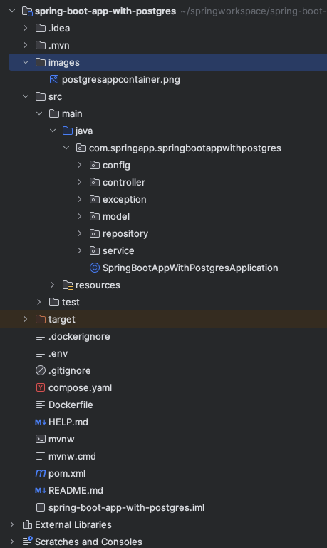
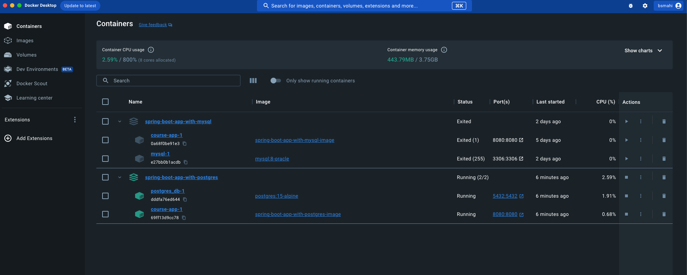

# Spring Boot Rest API with PostgresSQL

We will build a Spring Boot JPA Rest CRUD API for a Course application in that:

- Each Course has id, title, description, published status
- All the Api's help to perform create, retrieve, update, delete Courses
- We have also defined custom query method to retrieve details based on the title and published

## Technologies Used

- Java 17
- Spring Boot 3.1.x
- Spring Modules Covered: Spring Boot Web, Spring Data Jpa, Spring Actuator, OpenAPI
- Database: PostgresSQL
- Build Tool: Maven

We will develop a Course application by creating a Spring Boot JPA Rest CRUD API.

- Each Course has id, title, description, published status.
- Apis help to create, retrieve, update, delete Tutorials.
- Apis also support custom finder methods such as find by published status or by title.

These are APIs that we need to provide:

| HTTP Method |                    Urls                    |                    Description                    |
|:-----------:|:------------------------------------------:|:-------------------------------------------------:|
|    POST     |                /api/courses                |                 Create New Course                 |
|     GET     |                /api/courses                |                Get All the Courses                |
|     GET     |              /api/courses/:id              |             Retrieve a Course by :id              |
|     PUT     |              /api/courses/:id              |              Update a Course by :id               |
|   DELETE    |              /api/courses/:id              |              Delete a Course by :id               |
|   DELETE    |                /api/courses                |              Delete All the Courses               |
|     GET     | /api/courses/courses-title?title=[keyword] | Retrieve all Courses which title contains keyword |

## Project Folder Structure



Let me explain it briefly

- `Course.java` data model class corresponds to entity and table courses
- `CourseRepository.java` the interface extends JpaRepository for CRUD methods and custom finder methods. It will be
  autowired in CourseController
- `CourseController.java` the class where we will define all endpoints as a presentation layer
- Configuration for Spring Datasource, JPA & Hibernate in `application.properties`
- `pom.xml` contains all the dependencies required for this application

## Create Spring Boot Project

For pre-initialized project using Spring Initializer, please
click [here](https://start.spring.io/#!type=maven-project&language=java&platformVersion=3.1.5&packaging=jar&jvmVersion=17&groupId=com.springapp&artifactId=spring-boot-app-with-postgres&name=spring-boot-app-with-postgres&description=Demo%20project%20for%20Spring%20Boot&packageName=com.springapp.spring-boot-app-with-postgres&dependencies=web,data-jpa,lombok,actuator,postgresql)

## Configure Spring Datasource, JPA, Hibernate

```properties
spring.datasource.url=jdbc:postgresql://localhost:5432/postgres
# Replace username and password for your system
spring.datasource.username=postgres
spring.datasource.password=sairam123
spring.jpa.properties.hibernate.jdbc.lob.non_contextual_creation=true
spring.jpa.properties.hibernate.dialect=org.hibernate.dialect.PostgreSQLDialect
# Hibernate ddl auto (create, create-drop, validate, update)
spring.jpa.hibernate.ddl-auto=update
#Turn Statistics on
spring.jpa.properties.hibernate.generate_statistics=true
logging.level.org.hibernate.stat=debug
# Show all queries
spring.jpa.show-sql=true
spring.jpa.properties.hibernate.format_sql=true
```

## Define Course Entity

Our Data model is Course with four fields: id, title, description, published.
In model package, we define Course class.

```java
package com.springapp.springbootappwithpostgres.model;

import jakarta.persistence.*;
import lombok.AllArgsConstructor;
import lombok.Data;
import lombok.RequiredArgsConstructor;

@Entity
@Table(name = "courses")
@Data
@RequiredArgsConstructor
@AllArgsConstructor
public class Course {

    @Id
    @GeneratedValue(strategy = GenerationType.AUTO)
    private long id;

    @Column(name = "title")
    private String title;

    @Column(name = "description")
    private String description;

    @Column(name = "published")
    private boolean published;
}
```

- `@Entity` annotation indicates that the class is a persistent Java class
- `@Table` annotation provides the table that maps this entity
- `@Id` annotation is for the primary key
- `@GeneratedValue` annotation is used to define generation strategy for the primary key. `GenerationType.AUTO` means
  Auto Increment field
- `@Column` annotation is used to define the column in database that maps annotated field

## CourseRepository

Let's create a repository interface to interact with database operations

In _repository_ folder, create `CourseRepository` interface that `extends JpaRepository`

```java
package com.springapp.springbootappwithpostgres.repository;

import com.springapp.springbootappwithpostgres.model.Course;
import org.springframework.data.jpa.repository.JpaRepository;
import org.springframework.stereotype.Repository;

import java.util.List;

@Repository
public interface CourseRepository extends JpaRepository<Course, Long> {

    List<Course> findByTitleContaining(String title);

}
```

Since Spring is providing boilerplate/implementation code for the `findAll(), findById(), save(), delete()`
and `deleteById()` through `JpaRepository` interface

We can also define the custom methods:

- `findByTitleContaining()`: returns all Courses which title contains input title

## CourseController

Let's create CourseController class define the all the endpoints

```java
package com.springapp.springbootappwithpostgres.controller;

import com.springapp.springbootappwithpostgres.exception.CourseNotFoundException;
import com.springapp.springbootappwithpostgres.model.Course;
import com.springapp.springbootappwithpostgres.service.CourseService;
import io.swagger.v3.oas.annotations.Operation;
import org.springframework.http.HttpStatus;
import org.springframework.http.ResponseEntity;
import org.springframework.web.bind.annotation.*;
import org.springframework.web.servlet.support.ServletUriComponentsBuilder;

import java.util.List;
import java.util.Optional;

@CrossOrigin(origins = "http://localhost:8081") // to allow course-app frontend application
@RestController
@RequestMapping("/api/courses")
public class CourseController {

    private final CourseService service;

    public CourseController(CourseService service) {
        this.service = service;
    }

    // http://localhost:8080/api/courses/
    @GetMapping
    @Operation(summary = "Find All Course Details")
    public ResponseEntity<List<Course>> getAllCourses() {
        Optional<List<Course>> courses = service.findAll();

        return courses.map(courseDetails -> new ResponseEntity<>(courseDetails, HttpStatus.OK))
                .orElseThrow(() -> new CourseNotFoundException("No Courses are available.."));
    }

    // http://localhost:8080/api/courses/course-titles?title=boot
    @GetMapping("/course-titles")
    @Operation(summary = "Find courses By title")
    public ResponseEntity<List<Course>> getAllCoursesBasedOnTitle(@RequestParam String title) {
        Optional<List<Course>> courses = service.findByTitleContaining(title);

        return courses.map(courseDetails -> new ResponseEntity<>(courseDetails, HttpStatus.OK))
                .orElseThrow(() -> new CourseNotFoundException("No Courses are available.."));
    }

    // http://localhost:8080/api/courses/1
    @GetMapping("/{id}")
    @Operation(summary = "Find Course By Id")
    public ResponseEntity<Course> getCourseById(@PathVariable("id") long id) {
        Optional<Course> course = service.findById(id);

        return course.map(courseOne -> new ResponseEntity<>(courseOne, HttpStatus.OK))
                .orElseThrow(() -> new CourseNotFoundException("No Courses are available.."));

    }

    // http://localhost:8080/api/courses
    @PostMapping
    @Operation(summary = "Create a New Course")
    public ResponseEntity<Course> createCourse(@RequestBody Course course) {
        Optional<Course> newCourse = service.createCourse(course);
        var location = ServletUriComponentsBuilder.fromCurrentRequest()
                .path("/{id}")
                .buildAndExpand(newCourse.get().getId())
                .toUri();

        return ResponseEntity.created(location)
                .build();
    }

    @PutMapping("/{id}")
    @Operation(summary = "Update Course By Id")
    public ResponseEntity<Optional<Course>> updateCourse(@PathVariable("id") long id,
                                                         @RequestBody Course course) {
        var courseData = service.findById(id);

        if (courseData.isPresent()) {
            Course updateCourse = courseData.get();
            updateCourse.setTitle(course.getTitle());
            updateCourse.setDescription(course.getDescription());
            updateCourse.setPublished(course.isPublished());
            return new ResponseEntity<>(service.createCourse(updateCourse), HttpStatus.OK);
        } else {
            return new ResponseEntity<>(HttpStatus.NOT_FOUND);
        }
    }

    @DeleteMapping
    @Operation(summary = "Delete All Courses")
    public ResponseEntity<HttpStatus> deleteAllCourses() {
        service.deleteAllCourses();
        return new ResponseEntity<>(HttpStatus.NO_CONTENT);
    }

    @DeleteMapping("/{id}")
    @Operation(summary = "Delete Course By Id")
    public ResponseEntity<HttpStatus> deleteCourseById(@PathVariable("id") long id) {
        service.deleteCourseById(id);
        return new ResponseEntity<>(HttpStatus.NO_CONTENT);
    }

}
```

## Run & Test

Run Spring Boot application with command: `mvn spring-boot:run`

> Get All courses: http://localhost:8080/api/courses/

> Get A Single Course: http://localhost:8080/api/courses/1

> Get All course based on the title: http://localhost:8080/api/courses/course-titles?title=boot

> Create a new course: http://localhost:8080/api/courses

**Sample POST Request**

```json
{
  "title": "test title",
  "description": "testdescription",
  "published": false
}
```

> Delete All courses: http://localhost:8080/api/courses/

> Delete A Single Course: http://localhost:8080/api/courses/1

> Update A Single Course: http://localhost:8080/api/courses/1

**Sample PUT Request**

```json
{
  "title": "Updated test title",
  "description": "Updated test description",
  "published": true
}
```

## Create Dockerfile for Spring Boot App

Create .Dockerfile in the root folder

```properties
FROM maven:3.8.5-openjdk-17
WORKDIR /spring-boot-app-with-postgres
COPY . .
RUN mvn clean install -DskipTests
CMD mvn spring-boot:run
```

- FROM: install the image of the Maven – JDK version.
- WORKDIR: path of the working directory.
- COPY: copy all the files inside the project directory to the container.
- RUN: execute a command-line inside the container: mvn clean install -DskipTests to install the dependencies
  in `pom.xml`.
- CMD: run script `mvn spring-boot:run` after the image is built.

## Write Docker Compose configurations

On the root of the project directory, we'll create thecompose.yml file.

Follow version 3 syntax defined by Docker:

```yaml
version: '3.8'

services:
  course-app:
  postgres_db:

```

`version`: Docker Compose file format version will be used.
`services`: individual services in isolated containers.

Our application has two services: `course-app` (Spring Boot) and `postgres_db` (POSTGRES database).

Here go with the complete docker compose file

```yaml
version: '3.8'

services:
  course-app:
    image: spring-boot-app-with-postgres-image
    build:
      context: .
      dockerfile: Dockerfile
    ports:
      - $SPRING_LOCAL_PORT:$SPRING_DOCKER_PORT
    depends_on:
      - postgres_db
    environment:
      SPRING_DATASOURCE_URL: jdbc:postgresql://postgres_db:5432/$POSTGRES_DB
      SPRING_DATASOURCE_USERNAME: $POSTGRES_USER
      SPRING_DATASOURCE_PASSWORD: $POSTGRES_PASSWORD
  postgres_db:
    image: postgres:15-alpine
    env_file: ./.env
    environment:
      POSTGRES_USER: $POSTGRES_USER
      POSTGRES_PASSWORD: $POSTGRES_PASSWORD
      POSTGRES_DB: $POSTGRES_DB
    ports:
      - $POSTGRES_DB_LOCAL_PORT:$POSTGRES_DB_DOCKER_PORT
```

## Components of Docker Compose File

- course-app:
    - `image`: final image name
    - `build`: configuration options that are applied at build time that we defined in the _Dockerfile_ with relative
      path
    - `environment`: environmental variables that Spring Boot application uses
    - `ports` : Inbound and outbound ports
    - `depends_on`: dependency order, `postgres_db` is started before app
- postgres_db:
    - `image`: postgres image pull it from docker hub registry, if it is not available in the locally
    - `env_file`: specify our .env path that we will create later
    - `environment`: Specify the environment variables
    - `ports`: Inbound and outbound ports

## Docker Compose Environment variables

In the service configuration, we utilized environmental variables specified within the `.env` file.
Now we will create it.

### _.env_

> _**NOTE: REPLACE USERNAME AND PASSWORD AS PER YOUR NEED**_

```properties
POSTGRES_USER=postgres
POSTGRES_PASSWORD=sairam123
POSTGRES_DB=postgres
POSTGRES_DB_LOCAL_PORT=5432
POSTGRES_DB_DOCKER_PORT=5432
SPRING_LOCAL_PORT=8080
SPRING_DOCKER_PORT=8080
```

## Run the Spring Boot microservice with Docker Compose

> NOTE: Before executing the Docker Compose command, it is imperative to initiate the Docker Desktop software.**

To spin up the containers for both course-app and postgres database, execute the docker compose command given below.

> docker compose up

Docker will pull the postgres and Maven images (if our machine does not have it before).

The services can be run on the background with command:

> docker compose up -d

```logsyaml
puneethsai@Puneeths-MacBook-Pro spring-boot-app-with-postgres % docker compose up -d
[+] Running 10/10
 ✔ postgres_db 8 layers [⣿⣿⣿⣿⣿⣿⣿⣿]      0B/0B      Pulled                                                                                                                                           58.9s 
   ✔ 96526aa774ef Already exists                                                                                                                                                                     0.0s 
   ✔ 86da063037d7 Pull complete                                                                                                                                                                      0.8s 
   ✔ a93c97be5f7f Pull complete                                                                                                                                                                      0.9s 
   ✔ 9737661d941c Pull complete                                                                                                                                                                     42.4s 
   ✔ eb9232875c66 Pull complete                                                                                                                                                                      2.1s 
   ✔ f11c93c2122d Pull complete                                                                                                                                                                      2.1s 
   ✔ be31ef1a5d20 Pull complete                                                                                                                                                                      3.7s 
   ✔ b09d59c238cc Pull complete                                                                                                                                                                      3.7s 
 ! course-app Warning                                                                                                                                                                                3.8s 
[+] Building 97.7s (10/10) FINISHED                                                                                                                                                  docker:desktop-linux
 => [course-app internal] load build definition from Dockerfile                                                                                                                                      0.1s
 => => transferring dockerfile: 174B                                                                                                                                                                 0.0s
 => [course-app internal] load .dockerignore                                                                                                                                                         0.1s
 => => transferring context: 680B                                                                                                                                                                    0.0s
 => [course-app internal] load metadata for docker.io/library/maven:3.8.5-openjdk-17                                                                                                                 4.2s
 => [course-app auth] library/maven:pull token for registry-1.docker.io                                                                                                                              0.0s
 => CACHED [course-app 1/4] FROM docker.io/library/maven:3.8.5-openjdk-17@sha256:3a9c30b3af6278a8ae0007d3a3bf00fff80ec3ed7ae4eb9bfa1772853101549b                                                    0.0s
 => [course-app internal] load build context                                                                                                                                                         0.1s
 => => transferring context: 145.84kB                                                                                                                                                                0.0s
 => [course-app 2/4] WORKDIR /spring-boot-app-with-postgres                                                                                                                                          0.1s
 => [course-app 3/4] COPY . .                                                                                                                                                                        0.1s
 => [course-app 4/4] RUN mvn clean install -DskipTests                                                                                                                                              91.0s
 => [course-app] exporting to image                                                                                                                                                                  1.9s
 => => exporting layers                                                                                                                                                                              1.9s
 => => writing image sha256:f06b7c288ffcdbd583b2fb9884f455b9c42f11f970fe95aeb9ea9cb602a2b06d                                                                                                         0.0s 
 => => naming to docker.io/library/spring-boot-app-with-postgres-image                                                                                                                               0.0s 
[+] Running 3/3                                                                                                                                                                                           
 ✔ Network spring-boot-app-with-postgres_default          Created                                                                                                                                    0.6s 
 ✔ Container spring-boot-app-with-postgres-postgres_db-1  Created                                                                                                                                    0.3s 
 ✔ Container spring-boot-app-with-postgres-course-app-1   Created                                                                                                                                        0.1s 
```

## Containers Running in Docker Desktop



## Run & Test

Using OpenAPI Documentation, we'll be able to access all the operations, please access the below URL

> http://localhost:8080/swagger-ui/index.html

